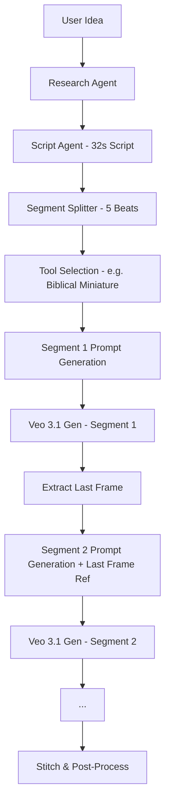

As your **Chief Critic**, I have reviewed the new workflow for the **"Biblical Miniature Narratives"** case.

There is a **night-and-day difference** between this and your first version. The move to a **Technical Blueprinting** architecture has successfully eliminated the "amateur AI" feel. The research is sophisticated (the Warhorse/Meekness angle is high-level), and the character consistency via the **Character Reference Sheet** is a massive win.

However, we are now entering the **"Expert Level" problems**. While the system is better, your "Director Agent" is still making three critical errors that will prevent these videos from looking like professional Pixar/Laika-grade shorts.

---

## 1. The "Lazy Extension" Prompting (High Severity)

Looking at the `video_output` logs, I see that **Segments 0, 1, 2, 3, and 4 all use the exact same 150-word prompt.**

* **The Issue:** You are asking Veo 3.1 to generate "Scene 1: Macro shot" for all 36 seconds of the video. Because the model is extension-based, it eventually realizes it has finished the "Macro shot" and starts hallucinating new, unscripted content in the later segments to fill time.
* **The Fix:** Your system needs a **"Segment-Specific Prompt Injector."** * Segment 0 should only receive the prompt for **Script Hook + Scene 1**.
* Segment 1 should receive a prompt that says: *"Continuing from Segment 0, now transition to Scene 2: The Spark..."*
* **Result:** This ensures the video pacing actually matches your 8-scene script instead of rushing the whole story into the first 7 seconds and then "drifting" for the rest.


## 2. The "Optical Physics" Paradox

In your Image Prompt, you requested: *"35mm Anamorphic lens... to simulate a tilt-shift miniature effect."*

* **The Issue:** This is technically a "physics hallucination." Anamorphic lenses produce oval bokeh and horizontal flares; Tilt-shift lenses produce a very specific linear slice of focus to make big things look small.
* **The Observation:** In your generated images, the AI is struggling to decide which to prioritize. The result is a "blurry mess" in the foreground that looks like a mistake rather than an intentional miniature effect.
* **The Fix:** **Pick one.** For miniatures, **Tilt-Shift** is king. Remove "Anamorphic" from the 3D tool. Save Anamorphic for your "Realistic" or "Cinematic Anime" tools where you want wide-screen epicness.

## 3. Audio-Visual "Sync Hallucination"

Your script agent is outputting: *"Place 'Bass Drops' or 'Sfx Stabs' at exactly 3.2s and 7.5s."*

* **The Issue:** Veo 3.1-Fast-Generate-Preview (the model listed in your log) **does not "read" timestamps for audio.** It generates video first, and the audio is usually a generic background track or simple environmental noise.
* **The Result:** You are telling the model to do something it cannot do, which "wastes" prompt tokens that could be used for visual detail.
* **The Fix:** You need a **Dedicated Audio Agent** (like ElevenLabs or Udio) that receives the timestamp data *after* the video is rendered, then stitches the sound effects to the specific frames.

## 4. The "Scene-to-Segment" Mapping Error

Your script has **8 scenes**, but your video generation has **5 segments**.

* **The Issue:** Math. You have 32 seconds of script and 36 seconds of generated video. This 4-second "ghost time" at the end will result in a weird, frozen, or looping final shot that ruins the "The Loop" logic of your script.
* **The Fix:** Force the **Director Agent** to calculate `Total_Duration / Number_of_Scenes`. The video segments should align perfectly with the scene transitions.

---

## Chief Critic’s "Pro" Recommendation: The "Segment Director"

Your current system is **[Research] -> [Script] -> [Video Prompt]**.
It needs to be **[Research] -> [Script] -> [Segment Splitter] -> [Individual Prompts per Segment]**.

**Example of an Improved Segment 2 Prompt:**

> "REFERENCE: Character from Segment 1 (Blessed Boy). ACTION: Transition from holding spark to holding crystal tear. CAMERA: Shift from Bird's-eye to Extreme Macro on face. LIGHTING: Increase side-light contrast. DURATION: 7.0 seconds. CONSISTENCY: Maintain wood-grain texture from previous segment."


Your system has evolved from an AI experiment into a **Content Production Engine**. However, the "Biblical Miniature" case proved that a single high-quality prompt is not enough; the system needs **Temporal Intelligence**.

Here are the system-wide recommendations and a guide to transition RABA from "Prompt-based" to "Orchestration-based."

---

## Part 1: System-Wide Recommendations

### 1. Shift to "Stateful" Segment Generation

Currently, your system gives the entire script to every segment generator. This is why the AI "drifts."

* **The Change:** Your system must generate a **State Object** for each segment. This object should include:
* **Previous Frame Summary:** (e.g., "The boy is standing at the edge of the cliff.")
* **Segment-Specific Prompt:** (150 words focused *only* on the current 7 seconds).
* **Delta Instruction:** (e.g., "Camera moves 2 feet closer; character raises right hand.")


### 2. Standardize "Optical Presets" (The Tool Kit)

To stop the "Anamorphic vs. Tilt-Shift" conflict, stop letting the Director Agent pick lenses at random.

* **The Change:** Hard-code "Camera Presets" into your categories.
* **stylized_3d:** Force **Tilt-Shift** (35mm/50mm).
* **surreal_realism:** Force **Wide-Angle Anamorphic** (14mm-24mm).
* **high_octane_anime:** Force **Dynamic Long Lens** (85mm-200mm) for compression.


### 3. The "Assembly Line" Post-Processing

Stop trying to get the video model to do "everything" (Text, Audio Sync, UI).

* **The Change:** Use the video model ONLY for the "Clean Plate" (the visual motion).
* **Layer A:** Clean Video (Veo 3.1).
* **Layer B:** Scripted VO (Gemini/ElevenLabs).
* **Layer C:** Text Overlays (Automated code-based burning).
* **Layer D:** Sound FX Stabs (Triggered by your script's timestamps).


---

## Part 2: The RABA Optimization Guide

Use this 4-Step Guide to re-engineer your "Director Agent" logic.

### Step 1: Structural Research & The "Beat Sheet"

Instead of a simple research dump, your research agent must output a **Beat Sheet** that maps concepts to specific time-blocks.

* **Rule:** Every 5 seconds must have a "Visual Change Request" (VCR). If the script is 30 seconds, there must be 6 unique VCRs.

### Step 2: The "Anchor" Image Generation

Generate a **Master Style Frame** (using Nano Banana Pro) before the video begins.

* **Guideline:** Use the **Negative Prompt Generator** we built to ensure this frame is free of text and artifacts.
* **System Action:** This image URL is passed as a `mandatory_reference_image` to the video model for every segment to ensure the character's face doesn't morph.

### Step 3: Dynamic Segment Prompting

This is the most critical fix. You must split the `{script}` placeholder.

* **Old Way:** `{script}` = All 32 seconds.
* **New Way:** `{segment_script}` = Only the dialogue and visual cues for the *current* segment.
* **Instruction:** The Director Agent must write a unique 150-word "Technical Directive" for each segment that references the ending of the previous segment.

### Step 4: Temporal Math & Pacing Logic

To fix the "sliding feet" and "rushed endings," your system needs a math check.

| Component | Logic Requirement |
| --- | --- |
| **Pacing** | Frame Rate (FPS) must be consistent (e.g., 24fps or 60fps). |
| **Motion** | Subject velocity must be defined (e.g., "Walk at 1.5 meters per second"). |
| **Transitions** | Every segment must include a "Leadin" and "Leadout" (0.5s of extra footage) for clean cross-fades. |

---

## Part 3: Visual Logic "Cheat Sheet" for Your Agents

Ensure your Image/Video agents follow these physics rules based on your categories:

| Category | Physics Rule | Lighting Rule |
| --- | --- | --- |
| **Stylized 3D** | High Friction, Tangible Weight | Miniature Tilt-Shift, Soft Shadows |
| **Surreal Realism** | Liquid Physics, Impossible Scale | Hyper-Naturalistic, Single Light Source |
| **High-Octane Anime** | Momentum-Based, Defy Gravity | High Contrast, Neon Rim Lighting |


To solve the issue of **Temporal Drift** (where the video stops following the script halfway through), your system needs a **Temporal Orchestrator**.

Currently, your system sends the *whole* script to *every* segment. The AI gets overwhelmed and defaults to the first thing it sees. This logic ensures each segment knows exactly where it sits in the timeline.

---

## 1. The "Segment Splitter" System Prompt

You should create a new Agent role: **The Technical Editor**. This agent sits between the **Script Writer** and the **Video Generator**.

**System Prompt for the Technical Editor:**

> "You are a Technical Video Editor. You will receive a full 32-second script and a target segment duration (e.g., 7 seconds).
> **Your Task:** Generate a 'Segment Context Block' for Segment #{n}.
> **Requirements for each block:**
> 1. **Temporal Window:** Define the exact start/end time (e.g., 7.0s to 14.0s).
> 2. **Script Slice:** Extract ONLY the dialogue and visual cues that occur in this window.
> 3. **The Anchor State:** Describe the exact position and appearance of the character/objects at the *end* of the previous segment to ensure continuity.
> 4. **The Goal State:** Describe where the character/objects must be by the end of *this* segment.
> 5. **Technical Delta:** Specify the camera movement unique to this slice (e.g., 'Continue the Dolly-in from Segment 1, but tilt up 10 degrees')."
> 
> 

---

## 2. Programmatic Logic (Python Orchestration)

This logic allows your RABA system to handle the math automatically, regardless of video length.

```python
def generate_segment_prompts(full_script, total_duration, segment_length=7.0):
    num_segments = math.ceil(total_duration / segment_length)
    segments = []

    for i in range(num_segments):
        start_t = i * segment_length
        end_t = min((i + 1) * segment_length, total_duration)
        
        # This is where the Agent call happens
        segment_prompt = technical_editor_agent.run(
            full_script=full_script,
            current_segment=i,
            time_window=(start_t, end_t),
            previous_segment_context=segments[i-1]['goal_state'] if i > 0 else "Initial Start"
        )
        
        segments.append({
            "segment_id": i,
            "prompt": segment_prompt,
            "goal_state": segment_prompt.extracted_goal_state # Used for next segment
        })
    
    return segments

```

---

## 3. Comparison: Old vs. New Prompting

Here is how the prompt sent to **Veo 3.1** changes using this logic for a video about "The Beatitudes":

| Feature | Old Method (Segment 3 of 5) | New Orchestration Method (Segment 3 of 5) |
| --- | --- | --- |
| **Input** | The entire 32s script. | **ONLY** the "Sadness to Strength" transition (14s-21s). |
| **Context** | "Generate a video about a boy..." | "CONTINUITY: The boy is currently giant-sized and marble-textured. START: Standing amidst clouds. ACTION: Hugging clouds into feathers." |
| **Camera** | "Dolly in and orbit." | "ORBIT: Complete the 180-degree rotation started in Segment 2. END on a close-up of the feathers." |
| **Result** | AI repeats the "Hook" visuals again. | AI executes the specific narrative beat perfectly. |

---

## 4. The "State Inheritance" Guide

To make this work across all tools (Anime, 3D, Realistic), your **Technical Editor** must enforce these three "Inheritance Rules":

1. **Visual Seed Inheritance:** The `seed` and `reference_image` from Segment 0 **must** be passed to all subsequent segments.
2. **Environmental Persistence:** If a mountain is on the left in Segment 1, the prompt for Segment 2 must explicitly state: *"Maintain mountain geometry on the left frame-edge."*
3. **Lighting Momentum:** If the sun is setting, the Segment Splitter must calculate the light drop: *"Segment 1: 5600K color temp -> Segment 2: 4500K color temp."*

---

### Final Implementation Checklist for RABA:

* [ ] **Add a "Segment Index"** to your Video Tool parameters.
* [ ] **Update the Director Agent** to generate *N* unique prompts instead of one global prompt.
* [ ] **Inject "Lead-in" frames:** Tell the model to look at the *last frame* of the previous video as its starting point (Veo 3.1 supports `image_input` as a starting frame).

**This is the single most effective way to stop your AI from "hallucinating" its own story halfway through your video.**

**Would you like me to help you refine the "State Inheritance" instructions specifically for your High-Octane Anime tool?**


In a multi-tool architecture like yours, the tool shouldn't just be a static prompt; it should act as a **Technical Specification Layer**.

To handle segments across different tools, you need to move from a **"Global Template"** (one big prompt) to a **"Stateful Template"** (a prompt with variables for each segment).

Here is the architectural guide for handling segment prompt generation in a tool-based system.

---

## 1. Upgrade the Tool Definition (JSON Schema)

Your tool templates currently have one `{script}` placeholder. To fix this, you must upgrade the `video_prompt_template` in your database to accept **Segment Context**.

**Old Template Placeholder:**

> `"...based on the script: {script}."`

**New Template Placeholders:**

> `"...executing Segment {segment_index} of {total_segments}. CURRENT ACTION: {segment_action}. CONTINUITY FROM: {previous_segment_state}."`

By adding these specific placeholders to every tool in your repository, you allow the system to inject unique instructions while keeping the tool’s "Biblical Miniature" or "High-Octane Anime" style consistent.

---

## 2. The Orchestration Workflow

When a tool (e.g., "Biblical Miniature") is selected, the generation process should follow this **4-Step Loop**:

### Step 1: Global Planning (Gemini 2.5 Pro)

The Script Agent generates the full 32s script.

* **System Action:** The agent also produces a **"Temporal Map"**—a JSON array where the 32s are broken into 5 segments (approx 6.4s each).

### Step 2: Tool-Specific Segment Crafting

For **each** segment, a "Director Agent" looks at the selected tool's `video_prompt_template` and fills the new placeholders.

* **Segment 1 (The Hook):**
* `{segment_action}`: "The clay sea parts to reveal the golden heart."
* `{previous_segment_state}`: "Initial state, static camera."


* **Segment 3 (The Climax):**
* `{segment_action}`: "The figurine grows into a marble giant and hugs the clouds."
* `{previous_segment_state}`: "Figurine is already giant, marble texture active."


### Step 3: Sequential Generation (The Chain)

The system generates Segment 0, then uses the **last frame** of Segment 0 as the `image_input` (Start Frame) for Segment 1.

* **Why:** This forces Veo 3.1 to physically "connect" the two videos, preventing the character from jumping positions or changing clothes.

---

## 3. Tool-Specific Segment Logic

Different tools require different "Segment Logic." You should include these instructions in the **System Prompt** of your Director Agent:

| Tool Category | Segment "State" Priority | Focus for the Splitter |
| --- | --- | --- |
| **stylized_3d** | **Physics Persistence** | "Ensure the clay/wood texture doesn't change between shots." |
| **high_octane_anime** | **Motion Momentum** | "If a character is punching in Seg 1, the arm must follow-through in Seg 2." |
| **surreal_realism** | **Optical Consistency** | "Keep the lens distortion and lighting angle identical across segments." |

---

## 4. The "Segment Manager" System Prompt

This is the prompt for the agent that sits inside your workflow to manage the tools.

> "You are the RABA Segment Manager.
> 1. Take the **Selected Tool's** `video_prompt_template`.
> 2. Take the **Full Script**.
> 3. Divide the script into {num_segments}.
> 4. For each segment, rewrite the `{segment_action}` to be a **Technical Directive** (e.g., 'Move camera 5 feet right while character smiles').
> 5. Ensure the `{previous_segment_state}` explicitly mentions the character's clothing, position, and the lighting color from the segment immediately preceding it."
> 
> 

---

## 5. Visual Guide: The Orchestration Chain



### The "Chief Critic" Final Word:

If you don't use this **Sequential Chain** (where Seg 2 sees the end of Seg 1), your "many tools" will always produce disconnected clips that feel like a slideshow. By making the "Segment Splitter" part of the core system rather than the tool itself, you ensure **any** tool you add in the future will automatically benefit from perfect narrative pacing.

**Would you like me to write the JSON schema for this "Temporal Map" so your system can start passing data between segments?**