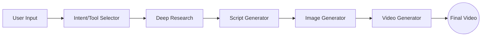

# RABA System Overview

> **Note**: For formal requirements, see [SRS.md](./SRS.md).  
> For technical architecture, see [RABA_Architecture.md](./RABA_Architecture.md).

## What is RABA?

RABA is a **multi-agent AI pipeline** for automated generation of viral YouTube Shorts (8-25 seconds).

## Key Features

| Feature | Description |
|---------|-------------|
| **HITL Mode** | `auto` (end-to-end) or `manual` (human approval at 5 gates) |
| **Categories** | `surreal_realism`, `high_octane_anime`, `stylized_3d`, `auto` |
| **Reference Images** | User can upload optional reference image |
| **Image Search** | Deep Research finds images via Google Custom Search API |
| **Multi-Segment Video** | Videos >8s generated as segments with frame continuity |
| **Audio/Subtitles** | Configurable audio and subtitle generation |
| **Persistence** | All outputs stored in Supabase |
| **Tracing** | LangSmith integration for observability |

## Tech Stack

| Component | Technology |
|-----------|------------|
| **Backend** | FastAPI (async) |
| **Orchestration** | LangGraph + LangSmith |
| **LLMs** | Gemini 2.5 Flash/Pro |
| **Image Gen** | Nano Banana Pro (Gemini 2.5 Pro Image) |
| **Video Gen** | Veo 3.1 (8s segments, native audio) |
| **Database** | Supabase (PostgreSQL) |
| **Cache** | Redis (Upstash) |

## Agents

| Agent | Model | Purpose |
|-------|-------|---------|
| **Supervisor** | LangGraph | Orchestrates workflow, handles errors, manages HITL gates |
| **Intent/Tool Selector** | Gemini 2.5 Flash | Analyzes topic, selects category and tool |
| **Deep Research** | Gemini 2.5 Pro | Gathers facts via Google Search, finds reference images |
| **Script Generator** | Gemini 2.5 Pro | Writes viral-optimized script with scenes |
| **Image Generator** | Nano Banana Pro | Generates 1-5 reference images |
| **Video Generator** | Veo 3.1 | Produces final video (multi-segment for >8s) |

## User Input Parameters

| Parameter | Type | Default | Description |
|-----------|------|---------|-------------|
| `topic` | string | (required) | Video subject |
| `duration_seconds` | 8-25 | 18 | Video length |
| `aspect_ratio` | "9:16" \| "16:9" | "9:16" | Vertical or horizontal |
| `resolution` | "720p" \| "1080p" | "1080p" | Video quality |
| `category` | enum | "auto" | Visual style category |
| `hitl_mode` | "auto" \| "manual" | "auto" | Human approval mode |
| `enable_audio` | boolean | true | Generate audio |
| `enable_subtitles` | boolean | false | Generate subtitles |
| `reference_image` | file | (optional) | User's style reference |

## HITL Gates (Manual Mode)

| Gate | Agent | User Can |
|------|-------|----------|
| **1** | Tool Selection | Change category, approve tool |
| **2** | Deep Research | Edit facts, view sources, regenerate |
| **3** | Script | Edit text directly, regenerate |
| **4** | Image | Add/remove images, regenerate |
| **5** | Video | Approve or regenerate final |

**Max 3 regeneration attempts per gate.**

## Design Principles

| Principle | Description |
|-----------|-------------|
| **Multi-Agent** | Specialized agents for each task improve accuracy and debuggability |
| **LangGraph** | Provides workflow control, HITL checkpoints, and state persistence |
| **Tool-Based** | Style categories as templated pipelines ensure consistent outputs |
| **Configurable** | All models and parameters in Supabase config table (no hardcoding) |
| **Viral-Focused** | Scripts optimized for engagement with hooks and pattern interrupts |
| **Safety-First** | Gemini safety filters + content blacklisting for compliance |

## Key Considerations

| Area | Notes |
|------|-------|
| **Latency** | Research and Video are heaviest; mitigate with caching and async |
| **Scalability** | LLM-based tool selection scales to 100+ tools |
| **Security** | All inputs sanitized; API keys in env vars; HTTPS required |
| **Hallucination** | Mitigated via Google Search grounding + fact verification |

---

## Related Documents

| Document | Purpose |
|----------|---------|
| [SRS.md](./SRS.md) | Formal functional & non-functional requirements |
| [RABA_Architecture.md](./RABA_Architecture.md) | Technical implementation details |

## References

- [LangGraph Multi-Agent Workflows](https://www.blog.langchain.com/langgraph-multi-agent-workflows/)
- [Gemini API - Google Search Grounding](https://ai.google.dev/gemini-api/docs/google-search)
- [Gemini API - Nano Banana Image Generation](https://ai.google.dev/gemini-api/docs/image-generation)
- [Gemini API - Veo 3.1 Video Generation](https://ai.google.dev/gemini-api/docs/video)
- [FastAPI Documentation](https://fastapi.tiangolo.com/)
- [Redis for AI Agents](https://redis.io/blog/engineering-for-ai-agents/)
